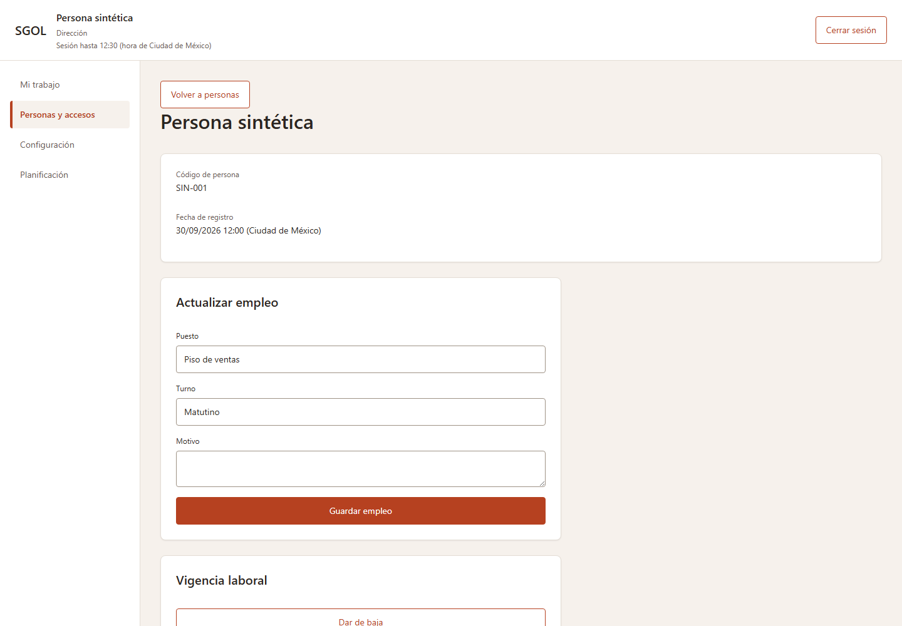
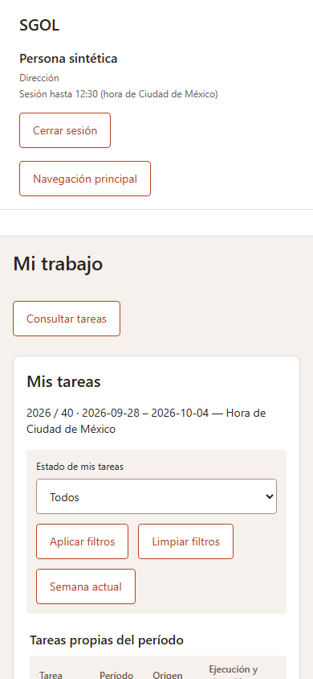

# SGOL — Capturas del hito de adaptación

2026-09-30. **Previsualizaciones Razor con datos sintéticos**, CSS y layout productivos actuales. No son capturas de una sesión real ni acreditan integración HTTPS/PostgreSQL. Los valores ocultos de credenciales/intenciones fueron retirados antes de exportar HTML; no se usó evidencia real. Código evaluado: `d6c3478c294f20d6bd21bb384cbf84fcdc336fbf`; documentación y artefactos se incorporan en el commit de cierre.

Las pantallas conservan su propósito. Cambian superficies, títulos, separación, filtros y agrupación visual. Ninguna captura habilita acciones fuera del contrato o de los permisos de servidor.

| Pantalla | Explicación sencilla | Capturas |
|---|---|---|
| Acceso | Los mismos campos de usuario y contraseña en un panel claro; el error sigue indicando cómo volver a intentar. | [Escritorio](evidence/diseno-renovado/Access-Index-empty-1440.png), [móvil](evidence/diseno-renovado/Access-Index-empty-390.png), [error](evidence/diseno-renovado/Access-Index-error-390.png) |
| Estado técnico de sucursal | La carga conserva su mensaje y esqueleto; no aparenta haber recibido datos antes de tiempo. | [Cargando](evidence/diseno-renovado/Branches-Details-loading-390.png) |
| Personas y accesos | Empleo, vigencia, disponibilidad e historial tienen sus propios bloques. La lista vacía conserva las acciones autorizadas. | [Escritorio](evidence/diseno-renovado/People-Details-normal-1440.png), [móvil](evidence/diseno-renovado/People-Details-normal-390.png), [lista vacía](evidence/diseno-renovado/People-Index-empty-390.png) |
| Configuración | Loretta, releases, definiciones TAR y políticas se distinguen mediante paneles. Seleccionar una TAR sigue mostrando sólo sus secciones existentes. | [TAR seleccionada](evidence/diseno-renovado/Configuration-Index-normal-1440.png) |
| Planificación y alta manual | Semana, calendario, borrador y alta manual mantienen formularios separados. Los controles que aún no pueden enviarse permanecen deshabilitados. | [Escritorio](evidence/diseno-renovado/Planning-Index-normal-1440.png), [móvil](evidence/diseno-renovado/Planning-Index-normal-390.png) |
| Asignaciones y carga | Consulta, historia, elegibilidad, corrección motivada y carga son bloques de la misma pantalla. Las tablas conservan todas sus columnas y pueden desplazarse dentro de su contenedor. | [Escritorio](evidence/diseno-renovado/asignaciones-normal-1440.png), [móvil](evidence/diseno-renovado/asignaciones-normal-390.png) |
| Confirmación del plan | El resumen y los dos botones conservan espacio dentro del modal. Cancelar recibe foco antes de publicar. | [Confirmación móvil](evidence/diseno-renovado/planes-confirmation-390.png) |
| Mi trabajo | Tareas propias, avisos y consulta autorizada conservan sus filtros independientes. El detalle conserva información e historia, sin incorporar evidencia o conclusión pendientes. | [Escritorio](evidence/diseno-renovado/MyWork-Index-normal-1440.png), [móvil](evidence/diseno-renovado/MyWork-Index-normal-390.png), [detalle](evidence/diseno-renovado/MyWork-Details-normal-1440.png) |
| Navegación móvil | Se abre como diálogo modal y enfoca Cerrar navegación. Escape devuelve el foco al botón que lo abrió. | [Navegación](evidence/diseno-renovado/navegacion-modal-390.png) |

Algunas filas usan cadenas como `` como nombres sintéticos para comprobar el escape de HTML; aparecen como texto y no son scripts ejecutados ni datos reales.

Mediciones entregadas: [198 casos visuales](evidence/diseno-renovado/checks.json), [34 casos de teclado](evidence/diseno-renovado/interactions.json), [11 pares de contraste](evidence/diseno-renovado/contrast.json). La colección completa externa contiene 66 capturas de estados a dos anchos; aquí se conserva una selección de 19 imágenes, incluido el encuadre inicial de las dos vistas anteriores. Texto ampliado se midió; no se afirma que cada imagen muestre ese estado. Los límites y la validación hospedada diferida están en [el informe](DISENO_RENOVADO_ADAPTACION.md).
